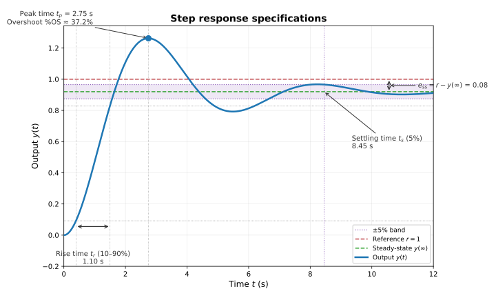

# Step response specifications

For a unit step reference (often $r=1$), common time-domain specifications are:

- **Rise time** $t_r$: time to go from 10% to 90% of the steady-state value $y(\infty)$.
- **Peak time** $t_p$: time at which $y(t)$ reaches its maximum.
- **Percent overshoot** %OS: $\dfrac{y_{\max} - y(\infty)}{y(\infty)} \times 100\%$.
- **Settling time** $t_s$ (5%): time after which $y(t)$ stays within $\pm 5\%$ of $y(\infty)$.
- **Steady-state error** $e_{ss}$: $r - y(\infty)$.

These specs are what we use to describe (and design for) a “good” transient response.

---

## Simple SISO reference tracking (constant reference, full observability)

Consider the LTI system

$$
\dot{x} = Ax + Bu, \qquad y = Cx,
$$

and suppose we want the **output** to track a **constant** reference $r$, i.e., $y(t)\to r$. A common controller is

$$
u = -Kx + k_{\text{ref}}\, r,
$$ 

where:
- choose $K$ so $(A-BK)$ is asymptotically stable;
- choose $k_{\text{ref}}$ to make the steady-state output match the reference.

If $r$ is constant and $(A-BK)$ is stable, then at steady state

$$
0 = (A-BK)x_{ss} + Bk_{\text{ref}}r
\quad\Rightarrow\quad
x_{ss} = -(A-BK)^{-1}B\,k_{\text{ref}}r,
$$

so

$$
y_{ss} = Cx_{ss} = -C(A-BK)^{-1}B\,k_{\text{ref}}r.
$$

To get $y_{ss}=r$, pick

$$
k_{\text{ref}} = -\frac{1}{C(A-BK)^{-1}B},
$$

assuming the scalar $C(A-BK)^{-1}B \neq 0$.

This is the **simpler SISO/full-observability** tracking setup. For a more general treatment, see
[Reference tracking](tracking.mdx).

