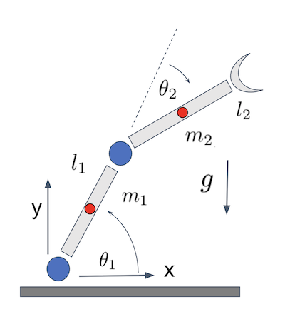

# Equations of Motion of a 2-DOF Planar Robotic Manipulator

Consider a planar 2-DOF robotic arm with constant link lengths $l_1, l_2$, link masses $m_1, m_2$, and moments of inertia about their centers of mass $I_1, I_2$. Let the distances from each joint to the respective center of mass be $c_1$ and $c_2$. Gravity acts in the negative $y$-direction. 
The joint angles make for excellent generalized coordinates, i.e. $q_1=\theta_1$, $q_2=\theta_2$.

---

## Kinematics for the Robot Arm Links

The position of the center of mass of the first link reads

$$
x_1 = c_1 \cos\theta_1, \quad
y_1 = c_1 \sin\theta_1,
$$
where $c_1$ encodes the location of the center of mass of link 1. For instance, $c_1=l_1/2$, if the link is symmetric and has uniform density. 
The equations relate the Cartesian coordinates of $m_1$ to the first generalized coordinate $\theta_1$. The position of the second link center of mass can be calculated via

$$
x_2 = l_1 \cos\theta_1 + c_2 \cos(\theta_1 + \theta_2), \quad
y_2 = l_1 \sin\theta_1 + c_2 \sin(\theta_1 + \theta_2),
$$

which accounts for the fact that the second arm is attached to the first and that we have another generalized coordinate, $\theta_2$, the second joint angle measured with respect to the orientation of the first link.
Once again, $c_2=l_2/2$, if the center of mass is at the midpoint of the link.
The above equations are sufficient to describe the translational kinematics of the robot arm. However, we also need to consider rotational kinematics. 

--- 

## Kinetic and Potential Energy
In order to construct the Lagrangian $L = T - V$  we need to deterimine the kinetic ($T$) and potential energy ($V$) of the system.
The total kinetic energy can be expressed as the sum of the rotational and translational kinetic energy

$$
\boxed{T = \frac{1}{2} m_1 v_1^2 + \frac{1}{2} I_1 \omega_1^2
  + \frac{1}{2} m_2 v_2^2 + \frac{1}{2} I_2 \omega_2^2.}
$$

Here, the squared velocities of the centers of mass of both links via $v_i^2=\dot{x}_i^2+\dot{y}_i^2$,  $i=1,2$, 

$$
v_1^2 = (c_1 \dot{\theta}_1)^2,\qquad
v_2^2 = l_1^2 \dot{\theta}_1^2 + c_2^2 (\dot{\theta}_1 + \dot{\theta}_2)^2
        + 2 l_1 c_2 \cos\theta_2\, \dot{\theta}_1 (\dot{\theta}_1 + \dot{\theta}_2).
$$
Since we also consider rotational kinematics we have to account for the change in the kinetic energy due to the rotation of each link about its center of mass.
The corresponding angular velocities read

$$
\omega_1 = \dot{\theta}_1, \qquad
\omega_2 = \dot{\theta}_1 + \dot{\theta}_2.
$$

The potential energy is:

$$
\boxed{V = m_1 g y_1 + m_2 g y_2
  = (m_1 c_1 + m_2 l_1) g \sin\theta_1 + m_2 c_2 g \sin(\theta_1 + \theta_2).}
$$

---

## Euler Lagrange Equations

The main idea is that the Euler–Lagrange equations result in the equations of motion for the links. To control that motion, external torques $\tau_i$ are required which modify
the joint angles $q_{1,2}=\theta_{1,2}$.

$$
\frac{d}{dt}\left( \frac{\partial L}{\partial \dot{q}_i} \right) - \frac{\partial L}{\partial q_i} = \tau_i,
\qquad i = 1,2,
$$

where $L = T - V$ is the above Lagrangian. The resulting equations are often expressed in the following form

<Result title='Equations of Motion for Robotic Manipulators'>
$$
M(q)\,\ddot{q} + C(q,\dot{q})\,\dot{q} + G(q) = \tau,
$$
</Result>
where $M$ is the so-called **Mass matrix** or **Inertia Matrix** that generally depends on the configuration of the arm, $C$ are the **Coriolis and Centrifugal Term** which 
depend on the velocity of the joint angles and the **Gravity Terms** are collected in G. 
The **torques**, in this example $\tau = [\tau_1,\ \tau_2]^T$, constitute the external input.

### The Inertia Matrix 
In our example of a two link robotic arm, we have two generalized coordinates

$$
q =
\begin{bmatrix}
\theta_1 \\[4pt]
\theta_2
\end{bmatrix}.
$$

and thus the inertia matrix $M$ consists of 4 elements:

$$ 
M(\theta) = 
\begin{pmatrix} M_{11} & M_{12} \\ M_{21} & M_{22}\end{pmatrix}.
$$

Those are

$$
\begin{align*}
M_{11} &= I_1 + I_2 + m_1 c_1^2 + m_2 \big( l_1^2 + c_2^2 + 2 l_1 c_2 \cos\theta_2 \big),\\
M_{12} &= I_2 + m_2 \big( c_2^2 + l_1 c_2 \cos\theta_2 \big),\\
M_{21} &= M_{12},\\
M_{22} &= I_2 + m_2 c_2^2.
\end{align*}
$$

Note that this matrix changes with the configuration of the robotic arm.

---

### Coriolis and Centrifugal Terms  
A common form of the velocity-dependent matrix $C(\theta,\dot{\theta})$ is:

$$ 
C(\theta,\dot\theta) = \begin{pmatrix} C_{11} & C_{12} \\ C_{21} & C_{22}\end{pmatrix} =
\begin{pmatrix} 0 & -h \big( 2 \dot{\theta}_1  + \dot{\theta}_2 \big) \\ h\,\dot{\theta}_1 & 0\end{pmatrix},
$$

where $h = m_2 l_1 c_2 \sin\theta_2$.
This means the matrix $C$ is traceless, and the inner product  $C(\theta,\dot{\theta})\cdot \dot{\theta}$ is a vector of the form

$$
C(\theta,\dot{\theta})\cdot \dot{\theta} = \begin{bmatrix}-h \big( 2 \dot{\theta}_1 \dot{\theta}_2 + \dot{\theta}_2^2 \big) \\h\,\dot{\theta}_1^2 \end{bmatrix}.
$$

---

### Gravity Terms

The remaining terms are due to gravity and are collected in $G(q)$. Since $G(q) = \frac{\partial V}{\partial q}$, we find

$$
G = \begin{bmatrix} (m_1 c_1 + m_2 l_1) g \cos\theta_1 + m_2 c_2 g \cos(\theta_1 + \theta_2) \\ m_2 c_2 g \cos(\theta_1 + \theta_2) \end{bmatrix}.
$$

---

### Final Equations of Motion
The final equations of motion read
<Result title='Equations of Motion for a 2R Manipulator'>
$$
\begin{align*}
\tau_1 &= M_{11}\,\ddot{\theta}_1 + M_{12}\,\ddot{\theta}_2 + C_{12} \dot{\theta}_2
         + G_1,\\
\tau_2 &= M_{21}\,\ddot{\theta}_1 + M_{22}\,\ddot{\theta}_2
         + C_{21} \dot{\theta}_1
         + G_2,
\end{align*}
$$
</Result>

---

## Trajectory Planning
To move the robotic arm smoothly from its initial configuration to the target configuration, we plan trajectories for the joint angles $\theta_1(t)$ and $\theta_2(t)$ over time and calculate the torques $\tau_1$ and $\tau_2$ that enable such motion.  
A common, even-though somewhat counterintuitive approach is **not** to solve the equations of motion for the joint angles but to assert that all angles must behave in a way that smooths transitions between the initial and final positions.
In other words, we postulate that a joint angle $\theta(t)$ must be representable through a cubic polynomial:

$$
\theta(t) = a_0 + a_1 t + a_2 t^2 + a_3 t^3
$$

The coefficients $a_0, a_1, a_2, a_3$ are computed from boundary conditions (initial/final positions, velocities, and optionally accelerations).

The time evolution of the joint angles is given by
$$
\begin{align*}
&\theta_1(t) = a_0 + a_1 t + a_2 t^2 + a_3 t^3,
&\theta_2(t) = b_0 + b_1 t + b_2 t^2 + b_3 t^3,
\end{align*}
$$
 and angular velocities and accelerations follow by differentiation:

$$
\begin{align*}
&\dot{\theta}_1(t) = \frac{d \theta_1(t)}{dt} = a_1 + 2 a_2 t + 3 a_3 t^2, 
&&\dot{\theta}_2(t) = \frac{d \theta_2(t)}{dt} = b_1 + 2 b_2 t  + 3 b_3 t^2 \\
&\ddot{\theta}_1(t) = \frac{d^2 \theta_1(t)}{dt^2} = 2 a_2  + 6 a_3 t, 
&&\ddot{\theta}_2(t) = \frac{d^2 \theta_2(t)}{dt^2}= 2 b_2  + 6 b_3 t.
\end{align*}
$$

With the joint velocities and accelerations known, the required joint torques $\tau_1$ and $\tau_2$ are computed using the inverse dynamics equation 

$$
\tau = M(\theta)\,\ddot{\theta} + C(\theta, \dot{\theta})\,\dot{\theta} + G(\theta), 
$$
by substituting $\theta_1, \theta_2, \dot{\theta}_1, \dot{\theta}_2, \ddot{\theta}_1, \ddot{\theta}_2$ for their corresponding polynomials.

---

## Numerical Example

Let us consider the an example with the following parameters:
- Link lengths: $l_1 = l_2 = 1.0 \,\text{m}$,
- Initial end-effector position: $(x_e, y_e)(0) = (2.0, 0.0) \,\text{m}$,
- Desired end-effector position: $(x_e, y_e)(T) = (1.0, 1.5) \,\text{m}$ , 
- $m_1 = 2\,\text{kg},\quad m_2 = 1 \,\text{kg}$,
- $I_1 = 0.1 \,\text{kg m}^2$, $I_2 = 0.05 \,\text{kg m}^2$,
- $g = 9.81 \,\text{m /s}^2$, the gravitational acceleration on Earth at sea-level
- $T = 2\,\text{s}$,

where $T$ is the total time it takes the end-effector to reach its target configuration.

---

### Step 1: Solve the Inverse Kinematics

First we need to calculate the value of the generalized coordinates at the initial and final times.
To achieve the desired end-effector position $(x_e, y_e)$, we solve the inverse kinematics problem to find the joint angles $\theta_1$ and $\theta_2$. From the end-effector position equations 

$$
x_e = l_1 \cos\theta_1 + l_2 \cos(\theta_1 + \theta_2), \quad
y_e = l_1 \sin\theta_1 + l_2 \sin(\theta_1 + \theta_2),
$$

we can derive

$$
\begin{align*}
\cos \theta_2 &= \frac{x_e^2 + y_e^2 - l_1^2 - l_2^2}{2 l_1 l_2}, \\
\sin \theta_2 &= \pm \sqrt{1 - \cos^2(\theta_2)},
\end{align*}
$$

and find the joint angles $\theta_1(T)$ and $\theta_2(T)$ required to achieve the target end-effector position

$$ 
\begin{align*}
\theta_2 &=\text{atan2}(\sin{\theta_2},\cos{\theta_2}),\\
\theta_1 &=  \text{atan2}(y_e, x_e)-\text{atan2}\left(l_2 \sin\theta_2, \, l_1 + l_2 \cos\theta_2\right) .
\end{align*}
$$

Here, $\text{atan2}(y,x)$ is the quadrant corrected acrtangent.
Inserting numerical values for $(x_e,y_e)(0)=(2,0)\,\text{m}$ and $(x_e,y_e)(T)=(1,1.5)\,\text{m}$ we find 

$$
\begin{align*}
&\theta_1(0) = 0,   && \theta_2(0) = 0, \\
&\theta_1(T) \approx 0.140,   & &\theta_2(T) \approx 0.896.
\end{align*}
$$

---

### Step 2: Boundary Conditions

Suppose we plan to reach the target configuration in $T=2$ seconds, starting from rest.  
Then, based on the inverse Kinematics we have
$$
\begin{align*}
&\theta_1(0) = 0,   && \theta_2(0) = 0, \\
&\theta_1(T) \approx 0.140,   & &\theta_2(T) \approx 0.896.
\end{align*}
$$
Since we also want the arm to be at rest before and after the maneuver we add
$$
\begin{align*}
&\dot{\theta}_1(0) = 0,  &\dot{\theta}_2(0) = 0,\\
&\dot{\theta}_1(T) = 0, &\dot{\theta}_2(T) = 0,
\end{align*}
$$
where all values have units of rad/s.

---

### Step 3: Compute Velocities and Accelerations
The joint angles should follow a cubic polynomial trajectory:
$$
\theta_1(t) = a_0 + a_1 t + a_2 t^2 + a_3 t^3, \qquad
\theta_2(t) = b_0 + b_1 t + b_2 t^2 + b_3 t^3,
$$
From the boundary conditions we can compute the coefficients for $\theta_1$ and $\theta_2$. 
Let us start with $\theta_1$. The boundary conditions
$\theta_1(0) = 0,\, \dot{\theta}_1(0) = 0$ imply that
$$
a_0 = 0, \quad a_1 = 0.
$$
The boundary contiions $\theta_1(T) \approx 0.140$ and  $\dot{\theta}_1(T) = 0$ result in 
$$
\begin{align*}
a_2 T^2 + a_3 T^3 &=  0.140, \\
2 a_2 T + 3 a_3 T^2 &= 0.
\end{align*}
$$
Since we know $T=2\,\text{s}$ we can solve for the coefficients
$$
a_2 = \frac{0.42}{T^2} = 0.105, \quad a_3 = -\frac{0.28}{T^3}=-0.035
$$
in units of rad/s$^2$ and rad/s$^3$, respectively.

Following a similar path, we find the coefficients for $\theta_2(t)$ 

$$
b_0 = 0, \quad b_1 = 0, \quad b_2=0.671 , \quad b_3=-0.224,
$$

The final equations for the joint angles and their derivatives in units of rad, rad/s and rad/s$^2$ read
<Result title='Planned Trajectory'>
$$
\begin{align*}
&\theta_1(t) =  0.105 t^2 -0.035 t^3, \quad \dot{\theta}_1(t) =  0.210 t - 0.105 t^2,
\quad \ddot{\theta}_1(t) =  0.210 - 0.210 t, \\
&\theta_2(t) =  0.671 t^2 -0.224 t^3, \quad \dot{\theta}_2(t) =  1.343 t - 0.671 t^2,
\quad \ddot{\theta}_2(t) =  1.343 - 1.343 t.
\end{align*}
$$
</Result>

---

### Step 4: Compute Required Torques

We can now compute the torques $\tau_1$ and $\tau_2$ by substituting the constants into the equations of motion
$$
M(\theta) \ddot{\theta} + C(\theta, \dot{\theta}) \dot{\theta} + G(\theta) = \tau
$$
This results in

$$
\begin{align*}
&M(\theta) = \begin{bmatrix} 2.65 + 2 \cos{\theta_2} & 0.6125 \\ 0.6125 & 1.05 \end{bmatrix}, \\
&C(\theta, \dot{\theta}) = \begin{bmatrix} 0 & -0.899\,(2\dot{\theta}_1+\dot{\theta}_2) \\ -0.899 \dot{\theta}_1 & 0 \end{bmatrix}, \\
&G(\theta) = \begin{bmatrix} 19.62 \cos{\theta_1} + 9.81 \cos{(\theta_1+\theta_2)} \\ 9.81 \cos{(\theta_1+\theta_2)}  \end{bmatrix}.
\end{align*}
$$

Inserting the polynomials for $\theta_1, \theta_2, \dot{\theta}_1, \dot{\theta}_2, \ddot{\theta}_1, \ddot{\theta}_2$ finally lets us write the required torques as function of time in units of Nm

$$
\begin{align*}
\tau_1 & = 1.378 - 1.379 t - 2.126 t^2 + 2.129 t^3 - 0.533 t^4 \\
&+ 9.81 \cos(0.776 t^2 - 0.259 t^3) + 0.42 \cos(0.671 t^2 - 0.224 t^3) \\
& -0.42 t \cos(0.671 t^2 - 0.224 t^3) + 19.62 \cos(0.105 t^2 - 0.035 t^3),\\
 \tau_2 &=1.538 - 1.540 t + 0.040 t^2 - 0.040 t^3 \\
 & + 0.010 t^4 + 9.81 \cos{(0.776 t^2 - 0.259 t^3)}.
 \end{align*}
$$

