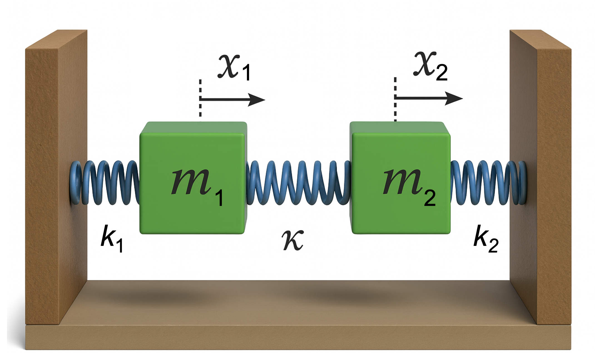
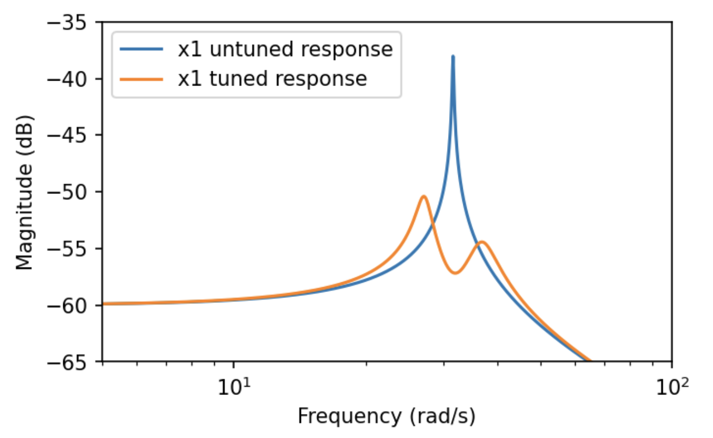

# Vibration Theory
<CalloutContainer slot="cards">
<CalloutCard title="Heads up!">
Vibration theory plays a critical role in understanding the behavior of structures and materials subjected to dynamic forces. Aircraft, spacecraft, and aerospace components are constantly exposed to various vibrational loads due to aerodynamic forces, engine operations, and external disturbances. Understanding and controlling these vibrations is essential for ensuring structural integrity, improving performance, and enhancing safety.  
</CalloutCard>
</CalloutContainer>
Vibration theory is concerned with the analysis of oscillatory systems, where objects experience periodic motion around an equilibrium point. This theory covers various types of vibrations, including free and forced vibrations, and encompasses different forms such as linear and nonlinear, damped and undamped, and single or multi-degree-of-freedom systems.  

Vibration analysis is applied to:

1. **Structural Dynamics**: Aircraft wings, fuselage, turbine blades, and landing gear are designed to withstand vibrational stresses.  
2. **Aeroelasticity**: The interaction between aerodynamic forces and structural elasticity can lead to phenomena such as flutter, which must be analyzed and controlled.  
3. **Vibration Isolation and Damping**: Ensuring passenger comfort and protecting sensitive avionics from harmful vibrational frequencies during flight or launch.  
4. **Resonance Avoidance**: Avoiding resonance frequencies in aerospace structures is critical to prevent catastrophic failures.  

This chapter will cover the fundamental concepts of vibrational systems, the governing equations of motion, and the analysis techniques required to model and solve vibration problems in aerospace structures.  

---

## The Harmonic Oscillator

The Harmonic Oscillator constitutes one of the most fundamental models in vibration theory. Its equations of motion in one dimension are:
<Result title="Equation of Motion for a Harmonic Oscillator">
$$
m \ddot{q} = -k q,
$$
</Result>
where $q(t)$ is the displacement of mass $m$ from its orginal position, and $k$ is a constant.
Initial conditions might look something like:
$$
q(t=0) = q_0, \quad \dot{q}(t=0) = p_0/m = v_0.
$$

The above equation of motion represents a spring-mass system, i.e., a mass connected to a wall via a spring. 
The restoring force produced by the spring grows proportionally to $k$ and to the displacement of the mass from its origin. Unless $k=0$, the mass will "vibrate", i.e. change its position relative to its equilibrium position $q_0$ in a periodic manner. 

The equations of motion can be solved either using sines and cosines or a complex exponential Ansatz which we will discuss later. 
Using trigonometric functions for our proposed solution we have
$$
q(t) = a \cos(\omega t) + b \sin(\omega t)
$$

$$
\dot{q}(t) = - a \,\omega \sin(\omega t) + b \,\omega \cos(\omega t)
$$

At $t=0$ we assume initial conditions $q(0) = q_0 = a$ and $\dot{q}(0) = b \omega$,
which means $b = \frac{v_0}{\omega}$. With that the final solution becomes:
$$
q(t) = q_0 \cos(\omega t) + \frac{v_0}{\omega} \sin(\omega t)
$$
which shows that the mass moves periodically about the center.

### Eigenfrequencies

A 1D Harmonic Oscillator such as we discussed above has precisely one period of oscillation, and, thus, one eigenfrequency $\omega$.
This frequency shows up in the $\sin$ and $\cos$ terms of our soltuion. Can we connect this frequency to physical parameters in our equation of motion?

If we differentiate our solution $q(t) = q_0 \cos(\omega t) + \frac{v_0}{\omega} \sin(\omega t)$ twice with respect to time we find
$$
\ddot{q}(t) = -\omega^2 q(t)
$$
On the other hand, from our equation of motion we know that
$$
\ddot{q}(t) = -\frac{k}{m} q(t)
$$
Comparing coefficients of $q(t)$ on the right hand side of both equations gives:
<Result title="Eigenfrequency of a 1D Harmonic Oscillator">
$$
\omega^2 = \frac{k}{m} \quad \Rightarrow \quad \omega = \sqrt{\frac{k}{m}}.
$$
</Result>
---

## Dampened Harmonic Oscillator

We can use [Newtonian Mechanics](https://aero.refpages.org/dynsys/newton/) to study the impact of adding a damping force to a harmonic oscillator: 
$$
m \ddot{q} = F_{res} + F_{dmp}.
$$
For linear restitution and damping proportional to velocity our equation of motion (EoM) reads
<Result title='Equation of Motion for the 1D dampened Harmonic Oscillator'>
$$
m \ddot{q} + c \dot{q} + k q = 0.
$$
</Result>
Using a complex exponential Ansatz, i.e., $q(t) = C e^{i \omega t}, \, C \in \mathbb{C}$ and $i^2=-1$. Inserting this $q(t)$ into the EoM we find
$$
-m \omega^2 + i c \omega + k = 0,
$$
which lets us calculate the eigenfrequencies
$$
\omega_{1,2} = \frac{i c \pm \sqrt{4 k m - c^2}}{2 m}
$$
Inserting this again into our Ansatz we find the general solution
$$
q(t) = C e^{-\frac{c t}{2 m}} \left( e^{\frac{i t \sqrt{4 k m - c^2}}{2 m}} + e^{-\frac{i t \sqrt{4 k m - c^2}}{2 m}} \right).
$$
Looking at the terms in the exponents we can define a damping timescale:
$$
\gamma = \frac{c}{2 m},
$$
and rewrite the solution $q(t)$ as:
<Result title="Solution for the 1D Dampened Harmonic Oscillator" >
$$
q(t) = C e^{-\gamma t} \left( e^{i t \sqrt{k/m - \gamma^2}} + e^{-i t \sqrt{k/m - \gamma^2}} \right)
$$
</Result>
Depending on the system this solution permits three kinds of behavior
- Underdamped (oscillatory): $\quad \quad \quad \, \,  \frac{k}{m} - \gamma^2 > 0$  
- Critically damped (fastest damping): $\frac{k}{m} - \gamma^2 = 0$  
- Overdamped (slow damping): $\quad \quad \, \,\,  \frac{k}{m} - \gamma^2 < 0$  

In order to convince ourselves that there is still some oscillatory behavior we can define $\omega_0^2 = \frac{k}{m} - \gamma^2$ and 
rewrite the above solution in trigonometric form:
$$
q(t) = A e^{-\gamma t} \cos(\omega_0 t + \phi).
$$

---

## Dampened Driven Harmonic Oscillator

Even more interesting behavior can arise when a harmonic oscillator is driven through an external, periodic force

$$
m \ddot{q} = F_{res} + F_{dmp} + F_{drv}.
$$

Assume

$$
F_{drv} = d \cos(\omega_f t + \phi_f).
$$

Then the equation of motion reads

$$
m \ddot{q} = -k q - c \dot{q} + d \cos(\omega_f t + \phi_f).
$$

This is an inhomogeneous differential equation of second order. The solution has to be found through superposition of the homogeneous and a particular solution:

$$
q(t) = q_h(t) + q_p(t)
$$

It is useful to rewrite the forcing term as a complex exponential:

$$
m \ddot{q} + c \dot{q} + k q = d \, e^{i(\omega_f t + \phi_f)}
$$

We are allowed to do this because

$$
e^{i (\omega_f t + \phi_f)} = \cos(\omega_f t + \phi_f) + i \sin(\omega_f t + \phi_f)
$$

and, thus,

$$
\text{Re}(d \, e^{i(\omega_f t + \phi_f)}) = d \cos(\omega_f t + \phi_f)
$$

It is again convenient to choose a complex Ansatz since we already know this works for the homogeneous case:

$$
q_h(t) = A e^{i(\omega t + \phi)}.
$$

We will furthermore assume that the particular solution can also be expressed in the form:

$$
q_p(t) = C e^{i(\omega_f t + \phi_f)}.
$$

Plugging the particular solution into the equation of motion results in

$$
- m \omega_f^2 C e^{i(\omega_f t + \phi_f)} + i c \omega_f C e^{i(\omega_f t + \phi_f)} + k C e^{i(\omega_f t + \phi_f)} = d \, e^{i(\omega_f t + \phi_f)}
$$

so that

$$
(- m \omega_f^2 + i c \omega_f + k) C e^{i(\omega_f t + \phi_f)} = d e^{i(\omega_f t + \phi_f)}.
$$

Calculating the complex amplitude $C$ for the particular solution yields

$$
C = \frac{d}{- m \omega_f^2 + i c \omega_f + k}.
$$

The particular solution, thus, reads

$$
q_p(t) = \frac{d}{- m \omega_f^2 + i c \omega_f + k} e^{i(\omega_f t + \phi_f)}.
$$

The total solution then reads

$$
q(t) = q_h + q_p = A e^{i(\omega t + \phi)} + \frac{d}{- m \omega_f^2 + i c \omega_f + k} e^{i(\omega_f t + \phi_f)}.
$$

## Resonance 
Let us investigate the above soltion in more detail. Assuming $q(0) = 0$, we can rewrite the solution $q(t)$ as

$$
- A e^{i \phi} = \frac{d}{- m \omega_f^2 + i c \omega_f + k} e^{i \phi_f}.
$$
Rewriting the above equation yields
$$
\begin{align*}
(- m \omega_f^2 + i c \omega_f + k) &= -\frac{d}{A} e^{i(\phi_f - \phi)},\\
(- m \omega_f^2 + i c \omega_f + k) &= -\frac{d}{A} e^{-i(\omega_f - \omega_f) t} e^{-i (\phi - \phi_f)},\\
a (- m \omega_f^2 + i c \omega_f + k) &= e^{-i \theta},\\
a (k - m \omega_f^2 + i c \omega_f) &= \cos(\theta) - i \sin(\theta).
\end{align*}
$$
Defining the scaled amplitude $a$ and phase difference $\theta$
$$
- \frac{A}{d} = a, \quad \phi - \phi_f = \theta, 
$$
and we can equate real and imaginary parts separately, i.e.,  
$$
\begin{align*}
a (k - m \omega_f^2) &= \cos(\theta), \\
a c \, \omega_f &= - \sin(\theta)
\end{align*}
$$
Squaring both equations

$$
a^2 (k - m \omega_f^2)^2 = \cos^2(\theta)
$$

$$
a^2 c^2 \, \omega_f^2 = \sin^2(\theta)
$$

and adding them again gives the magnitude:

$$
a^2 \left[(k - m \omega_f^2)^2 + c^2 \omega_f^2 \right] = 1.
$$

Expressing $a$ from the previous equation gives

$$
a(c, m, \omega_f) = \frac{1}{\sqrt{(k - m \omega_f^2)^2 + c^2 \omega_f^2}} \cdot \text{sgn} \left(\frac{-\sin(\theta)}{c \, \omega_f}\right)
$$

Rewriting the previous equation for the scaled amplitude $a$ in a slightly different form yields
$$
|a| = \frac{1}{\sqrt{m^2 (k/m - \omega_f^2)^2 + c^2 \omega_f^2}}
$$
and with
$$
\omega_0 = \sqrt{\frac{k}{m}}, \quad \zeta = \frac{c}{2 \sqrt{m k}}, \quad c = 2 \zeta \omega_0
$$
where $\zeta$ is the so-called "damping ratio", we can find the amplitude $A$ in terms of damping ratio:

<Result title='Amplitude of Dampened Driven Harmonic Oscillator'>
$$
|A| = \frac{d}{m} \frac{1}{\sqrt{(\omega_0^2 - \omega_f^2)^2 + (2 \zeta \omega_0 \omega_f)^2}}.
$$
</Result>
Finally, the phase difference between forcing and the response of the harmonic oscillator reads
$$
\theta = \arctan \left( \frac{2 \zeta \omega_f \omega_0}{\omega_f^2 - \omega_0^2} \right),
$$

These equations contain a well-known condition for [resonance](https://en.wikipedia.org/wiki/Resonance). If the driving frequency and the natural frequency coincide and damping is insufficient, the amplitude of the driven oscillator increases dramatically.

---
## Coupled Harmonic Oscillators

Coupled harmonic oscillators are used as a model in several different fields to better understand energy exchange between vibrating modes in systems such as airfoils, 
or buildings subject to external forcing. Taking the example from the lecture, we have two spring mass systems, 
each coupled to its nearest wall with a spring with a coefficient $k_1=k_2=k$. The displacement of said masses from their origins is given by $x_1(t)$ and $x_2(t)$, respectively. Both masses are also coupled with a center spring with a potentially different coefficient $\kappa$. 

The corresponding equations of motion read

$$
\begin{align*}
m\,\ddot{x}_1 &= -(k+\kappa)\, x_1 + \kappa\, x_2, \\
m\,\ddot{x}_2 &= -(k+\kappa)\, x_2 + \kappa\, x_1.
\end{align*}
$$

Since the coupling is linear in the states, we can rewrite that system in matrix form

$$
\ddot{\mathbf{x}} = M \mathbf{x},
$$

where

$$
\mathbf{x} = 
\begin{pmatrix}
x_1 \\ x_2
\end{pmatrix}
$$

and

$$
M = \frac{1}{m} 
\begin{pmatrix}
-(k+\kappa) & \kappa \\
\kappa & -(k+\kappa)
\end{pmatrix}.
$$

This step will enable us to elegantly decouple the system by transforming into the Eigensystem of the differential equations via the (mass weighted) coupling matrix $M$. 
The aim is to transform the system into the following form
$$
\ddot{\mathbf{q}} = N \mathbf{q},
$$
where each component is decoupled from each other, so that $N$ becomes diagonal. To this end we determine the Eigenvalues ($\lambda$) and Eigenvectors ($\mathbf{v}$) of $M$
$$
\lambda_1 = -k, \quad \lambda_2 = -k - 2\kappa,
$$
and
$$
\mathbf{v}_1 = \frac{1}{\sqrt{2}}
\begin{pmatrix}1 \\ 1\end{pmatrix}, \quad
\mathbf{v}_2 = \frac{1}{\sqrt{2}}
\begin{pmatrix}1 \\ -1\end{pmatrix}.
$$
Using the Eigenvectors we can define a basis change matrix $S$ that will allow us to find the new $\mathbf{q}$ from $\mathbf{x}$. This can be achieved by ensuring that 
$S$ has the Eigenvectors of $M$ as columns:
$$
S = \frac{1}{\sqrt{2}}
\begin{pmatrix}1 & 1 \\ 1 & -1\end{pmatrix}.
$$
Then
$$
\mathbf{q} = S \mathbf{x}
$$
and
$$
q_1 = x_1 + x_2, \quad q_2 = x_1 - x_2.
$$
Similarly, we can find $N$ as
$$
N = S^{-1} M S,
$$
which eventually reads
$$
N = \frac{1}{m} 
\begin{pmatrix}-k & 0 \\ 0 & -k-2\kappa\end{pmatrix}.
$$
The new, **decoupled Eigensystem of harmonic oscillators** has the following equations of motion
$$
\ddot{\mathbf{q}} = N \mathbf{q}
$$
Those can now be solved conveniently via our standard Ansatz
$$
q_1(t) = e^{i \omega_1 t}, \quad q_2(t) = e^{i \omega_2 t}.
$$

Inserting the above into the differential equations yields

$$
\begin{align*}
-m \omega_1^2 e^{i \omega_1 t} &= -k e^{i \omega_1 t},\\
-m \omega_2^2 e^{i \omega_2 t} &= -(k + 2\kappa) e^{i \omega_2 t}.
\end{align*}
$$

With corresponding normal/Eigenfrequencies
$$
\omega_1 = \omega_f = \sqrt{\frac{k}{m}}, \quad \omega_2 = \omega_s = \sqrt{\frac{k + 2\kappa}{m}}.
$$

The Eigenmode solutions then read

$$
q_1(t) = A_1 e^{i \left(\sqrt{\frac{k}{m}} t + \phi_1\right)}, \quad q_2(t) = A_2 e^{i \left(\sqrt{\frac{k + 2\kappa}{m}} t + \phi_2\right)}.
$$

In order to translate the Eigenmode solutions into our original coordinates, we need the inverse of our basis transformation matrix $S$:

$$
S^{-1} = \frac{1}{\sqrt{2}}
\begin{pmatrix}1 & 1 \\ 1 & -1\end{pmatrix}, \quad \mathbf{x} = S^{-1} \mathbf{q}\, \Rightarrow\, \mathbf{x} = 
\begin{pmatrix} q_1 + q_2 \\ q_1 - q_2 \end{pmatrix}.
$$
### Example:
Let us assume the two coupled harmonic oscillators are subject to the following initial conditions

$$
\phi_1 = \phi_2 = 0, \quad x_1(0) = 1, \quad x_2(0) = 0, \quad m = 1, \quad k = 4, \quad \kappa = 2.
$$

Since we already did all the work by transforming the equations of motion in $\mathbf{x}$ to the decoupled system $q$ and solving the latter, we know solutions for $\mathbf{x}$ explicitly:

$$
\begin{align*}
x_1 &= q_1 + q_2 &= A_1 e^{i \left(\sqrt{\frac{k}{m}} t + \phi_1\right)} + A_2 e^{i \left(\sqrt{\frac{k + 2\kappa}{m}} t + \phi_2\right)},\\
x_2 &= q_1 - q_2 &= A_1 e^{i \left(\sqrt{\frac{k}{m}} t + \phi_1\right)} - A_2 e^{i \left(\sqrt{\frac{k + 2\kappa}{m}} t + \phi_2\right)}.
\end{align*}
$$
Inserting the initial conditions we find
$$
\begin{align*}
x_1 = A_1 + A_2 = 1, \\
x_2 = A_1 - A_2 = 0.
\end{align*}
$$

This is a system of two equations with two unknown amplitudes $A_1$ and $A_2$. The solution for the amplitudes is $A_1 = A_2 = 0.5$, which, together with the other initial conditions, gives

$$
\mathbf{x}(t) = 
\begin{pmatrix} x_1(t) \\ x_2(t) \end{pmatrix} = \frac{1}{2} 
\begin{pmatrix} e^{2 i t} + e^{\sqrt{8} i t} \\ e^{2 i t} - e^{\sqrt{8} i t} \end{pmatrix}.
$$

--- 

## Tuned Mass Dampers

<CalloutContainer slot="cards">
<CalloutCard title="Heads up!">
Tuned Mass Dampers (TMDs) are passive control systems designed to absorb and reduce the amplitude of mechanical vibrations. 
TMDs are particularly beneficial in scenarios where resonant frequencies of structures, such as aircraft wings or spacecraft components, can lead to undesirable dynamic responses.
In aerospace structures, TMDs are strategically placed to address critical modes of vibration, thereby improving performance, safety, and longevity of the structure. 
</CalloutCard>
</CalloutContainer>

A **tuned mass damper** (TMD) is a device used to reduce the amplitude of mechanical vibrations. 
It consists of a mass, a damper, and a spring, which is tuned to a specific frequency to counteract resonant vibrations. 
By adding an auxiliary mass to the structure, which is tuned to a specific frequency, and connected to the main structure through a spring and a damper, 
the system transfers energy from the vibrating structure to the damper, reducing resonance amplitudes. Tuned mass dampers are widely used in aerospace applications to mitigate unwanted vibrations in structural systems. 

Consider a single-degree-of-freedom system with mass $m_1$, damping $c_1$, and stiffness $k_1$. The equation of motion for this system under a harmonic force, for instance, $F(t) = F_0 \cos(\omega t)$ is:

$$
m_1 \ddot{x}_1(t) + c_1 \dot{x}_1(t) + k_1 x_1(t) = F(t)
$$

Now, we add a tuned mass damper with mass $m_2$, damping $c_2$, and stiffness $k_2$. 
The TMD is attached to the primary mass and introduces an additional degree of freedom. 

Let $x_t(t)$ be the displacement of the TMD mass. Then, the coupled equations of motion for the combined system are:

$$
\begin{align*}
&m_1 \ddot{x}_1 + c_1 \dot{x}_1 + k_1 x_1 + c_2 (\dot{x}_1 - \dot{x}_2) + k_2 (x_1 - x_2) = F(t),\\
&m_2 \ddot{x}_2 + c_2 (\dot{x}_2 - \dot{x}_1) + k_2 (x_2 - x_1) = 0.
\end{align*}
$$

The damping force provided by the TMD is proportional to the relative velocity between the two masses, given by:

$$
F_{\text{damping}} = c_2 (\dot{x}_1 - \dot{x}_2)
$$

## Tuning the TMD
The goal of tuning is to select the TMD parameters $m_2$, $c_2$, and $k_2$ to minimize the vibration amplitude at the resonance frequency of the primary system, $\omega_1$, which occurs at:

$$
\omega_1 = \sqrt{\frac{k_1}{m_1}}
$$

To tune the TMD we want the natural frequency of the TMD should match the resonance frequency of the primary system:
$$
\omega_2 = \sqrt{\frac{k_2}{m_2}} = \omega_1
$$
This ensures that the TMD is tuned to the frequency where the primary system has its largest response.
The damping ratio of the TMD, $\zeta_2 = \frac{c_2}{2 \sqrt{k_2 m_2}}$, is chosen to provide optimal damping. 
A typical choice for optimal damping is $\zeta_t \approx 0.1$ to $0.2$.

### Example
Consider a system where the primary mass is $m_1 = 1000 \, \text{kg}$, stiffness $k_1 = 1 \times 10^6 \, \text{N/m}$, and damping $c_1 = 200 \, \text{Ns/m}$. 
The target resonance frequency is:

$$
\omega_1 = \sqrt{\frac{k_1}{m_1}} = 31.62 \, \text{rad/s}
$$

For the TMD, we select $m_2 = 100 \, \text{kg}$. To tune the natural frequency of the TMD to $\omega_1$, we choose the stiffness of the TMD as:

$$
k_2 = m_2 \omega_2^2 = m_2 \omega_1^2 = 100 \times 1000 = 1 \times 10^5 \, \text{N/m}
$$

Now, select the damping ratio $\zeta_2 = 0.1$ to find the damping coefficient of the TMD:

$$
c_2 = 2 \zeta_2 \sqrt{k_2 m_2} =  2 \times 0.1 \times \sqrt{10^5 100} = 632.46 \, \text{Ns/m}.
$$

## Bode Plots

The TMD is tuned to match the resonant frequency of the primary system. Bode diagrams can be used to visually confirm the reduction in the resonant peak. The figure below 
shows the tuned parameter configuration from the example below. The blue curve is the frequency response without TMD, the orange one with TMD. 

The figure shows that 
even TMDs that only weigh a fraction of the driving mass can reduce the peak amplitude by a factor of 100 (roughly -20dB power) in the vicinity of the resonance frequency!

## Transfer Functions
Using the Transfer Function of a system featuring tuned mass damper is another possible way to tune TMDs.
Consider again the single-degree-of-freedom system with mass $m_1$, damping $c_1$, and stiffness $k_1$. The equation of motion is
$$
m_1 \ddot{x}_1(t) + c_1 \dot{x}_1(t) + k_1 x_1(t) = F(t)
$$
Taking the Laplace transform yields
$$
m_1 s^2 X(s) + c_1 s X(s) + k_1 X(s) = F(s),
$$
The transfer function $H(s)$ of this undamped system is then defined as the function relating the displacement $X(s)$ to the input force $F(s)$
$$
H(s) = \frac{X(s)}{F(s)} = \frac{1}{m_1 s^2 + c_1 s + k_1},
$$
where $s = i \omega$. Now, we add a tuned mass damper with mass $m_2$, damping $c_2$, and stiffness $k_2$. The combined system reads
$$
\begin{align*}
&m_1 \ddot{x}_1 + c_1 \dot{x}_1 + k_1 x_1 + c_2 (\dot{x}_1 - \dot{x}_2) + k_2 (x_1 - x_2) = F(t),\\
&m_2 \ddot{x}_2 + c_2 (\dot{x}_2 - \dot{x}_1) + k_2 (x_2 - x_1) = 0.
\end{align*}
$$
Taking the Laplace transform of the coupled equations (assuming zero initial conditions) 
and solving for the transfer function relating the displacement $X(s)$ to the input force $F(s)$, we get the combined system's transfer function:
$$
H_{\text{TMD}}(s) = \frac{X(s)}{F(s)} = \frac{m_2 s^2 + c_2 s + k_2}{(m_1 s^2 + c_1 s + k_1)(m_2 s^2 + c_2 s + k_2) - (c_2 s + k_2)^2}
$$
This transfer function describes the dynamic response of the primary mass when influenced by the TMD,
where again $H(s) = X(s)/F_{ext}(s)$ represents the amplitude gain and $s = i \omega_1$. The natural frequency of the forced system without the second mass is 
$\omega_1 = \sqrt{k_1/m_1}$. We then choose $k_2 = \omega_2^2 m_2$ to hit the same frequency. 
This means the Transfer function is only a function of $c_2$ and $s$. We can then proceed to find the minimum of $H(c_2,s)$ by following the gradient $-\nabla H(c_2,s)$ or using another optimization method to minimize the maximum value of the transfer function.

